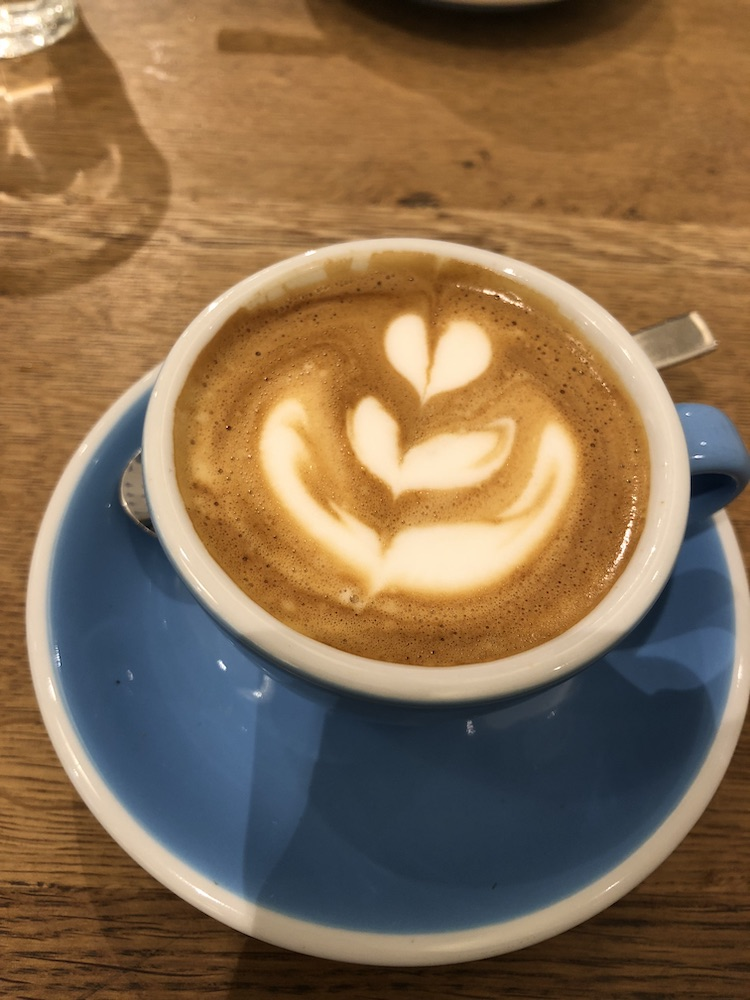
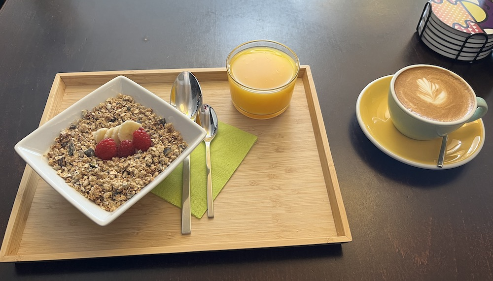
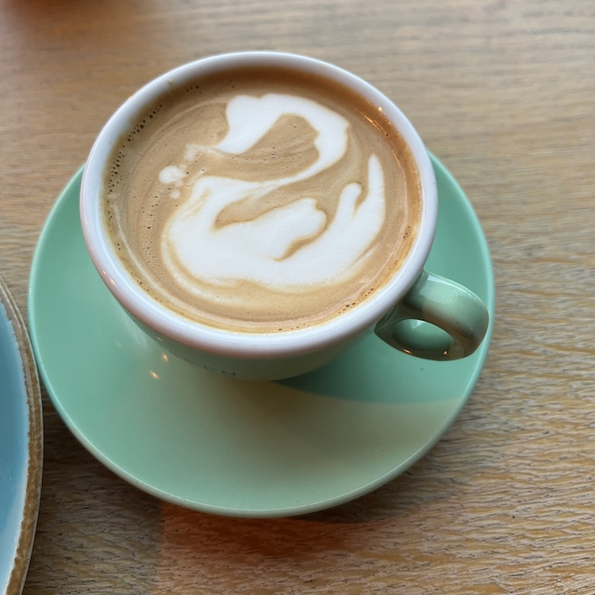
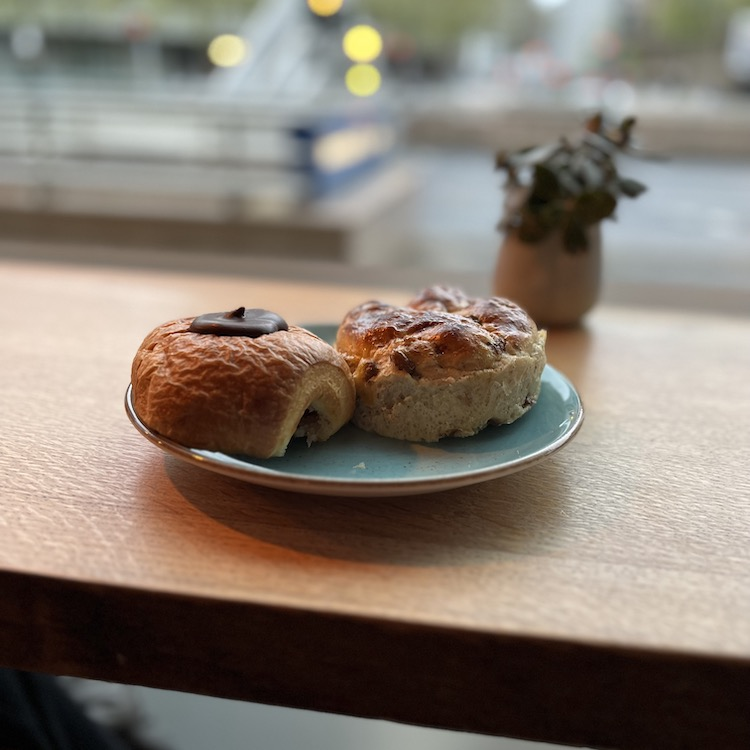
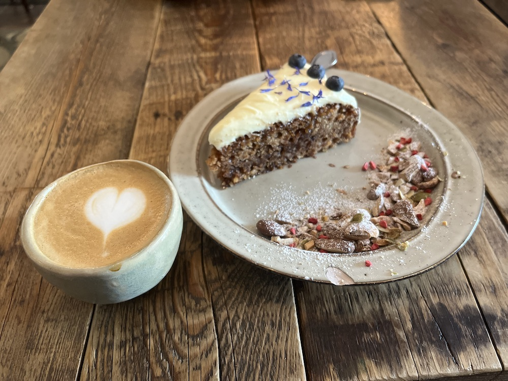
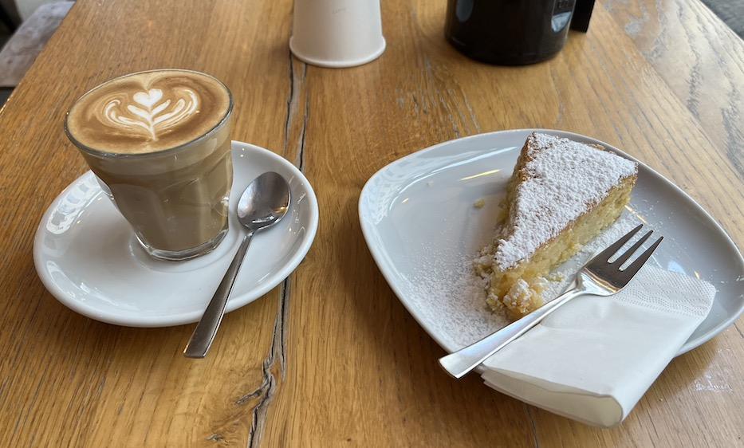

# Coffee Sanctuary

Welcome to my personal coffee sanctuary. This is a list of all the coffee shops that I went to, so that I can check if there's a nice coffee shop in town when travelling. 
It's similar to all those "Awesome something" lists, but it's based on my personal experience with coffee shops. 

If you have any proposals of coffee shops that I should visit, please [create an issue for it](https://github.com/programming-wolf/coffee-sanctuary/issues/new). Should you find any mistakes regarding websites, addresses, or anything related to one of the coffee shops listed here, feel free to create a pull request. :-)

## Berlin
### The Barn
I actually never visited one of the cafés. However, I do have a coffee subscription for pour-over coffee with them, and most of the coffees were great. 
They do have several (9, I believe) shops in Berlin. 
* Coffee: self-roasted. Great coffee beans for both pour over and espresso-based drinks. 
* Website: [https://thebarn.de](https://thebarn.de)

### Father Carpenter
* Address: Münzstraße 21, 10178 Berlin ([Google Maps](https://goo.gl/maps/jDM9FEXEsEazmqqf8), [Apple Maps](https://maps.apple.com/?address=M%C3%BCnzstra%C3%9Fe%2021,%20Mitte,%2010178%20Berlin,%20Germany&ll=52.524799,13.406807&q=M%C3%BCnzstra%C3%9Fe%2021))
* Coffee: self-roasted. I only tried espresso-based drinks. Espresso was a bit too sour for my taste, but Cappuccino and Flat White tasted amazing.
* Food: super tasty. Recommendations are the vegan banana bread and the "Avocado", sour-dough toast with several toppings.
* Website: [https://fathercarpenter.com](https://fathercarpenter.com)

## Dresden
### Moka Café
* Address: Schützengasse 2, 01067 Dresden ([Google Maps](https://goo.gl/maps/e2D4xYavoAg4JmBU8), [Apple Maps](https://maps.apple.com/?address=Sch%C3%BCtzengasse%202,%2001067%20Dresden,%20Germany&ll=51.054467,13.727288&q=Sch%C3%BCtzengasse%202))
* Coffee: _not_ self-roasted. When I was there, they had coffee from The Barn (see above) and [Manhattan Coffee Roasters](https://manhattancoffeeroasters.com). Nevertheless, it was prepared well and tasted great. 
* Food: Amazing self made granola and cookies.

## Düsseldorf
### Copenhagen Coffee Lab
* Addresses:
  * Berliner Allee 29, 40212 Düsseldorf ([Google Maps](https://goo.gl/maps/YkpnVNYAvkQNRhWJ6), [AppleMaps](https://maps.apple.com/?address=Berliner%20Allee%2029,%2040212%20D%C3%BCsseldorf,%20Germany&ll=51.223222,6.782331&q=Berliner%20Allee%2029))
  * Frankenstraße 41, 40476 Düsseldorf ([Google Maps](https://goo.gl/maps/BExNtNTqgApzsDT16), [Apple Maps](https://maps.apple.com/?address=Frankenstra%C3%9Fe%2041,%2040476%20D%C3%BCsseldorf,%20Germany&ll=51.250157,6.781686&q=Frankenstra%C3%9Fe%2041))
* Coffee: self-roasted. Very good flat white, even the decaf was tasty (which was a first). 
* Food: All the food, both sweet and regular things, are incredible. I strongly recommend the cheese cake with raspberries. 
* Website: [http://copenhagencoffeelab.com/](http://copenhagencoffeelab.com/)

## Ingolstadt
### District V
* Address: Donaustraße 3, 85049 Ingolstadt ([Google Maps](https://goo.gl/maps/jGBwNxFWz6hbivQb8), [Apple Maps](https://maps.apple.com/?address=Donaustra%C3%9Fe%203,%2085049%20Ingolstadt,%20Germany&ll=48.761820,11.425360&q=Donaustra%C3%9Fe%203))
* Coffee: self-roasted. Great espresso-based drinks and pour over coffee.
* Food: Amazing food. I recommend the Bircher Müsli and franzbrötchen.
* Website: [https://www.district-five.de](https://www.district-five.de)

## Mannheim
### Café Brue
* Address: Q7 27, 68161 Mannheim ([Google Maps](https://goo.gl/maps/xDfDoH8ZsQNZZaJy8), [Apple Maps](https://maps.apple.com/?address=Q7%2027,%2068161%20Mannheim,%20Germany&auid=14227653974416950084&ll=49.486061,8.473216&lsp=9902&q=Caf%C3%A9%20BRUE&t=m))
* Coffee: self-roasted. Tasty espresso and amazing cold drip coffee (cold drip on the rocks).
* Website: [https://cafebrue.de/](https://cafebrue.de/) 

## Nuremberg
### Machhörndl
* Addresses:
  * Ob. Kieselbergstraße 13, 90429 Nürnberg ([Google Maps](https://goo.gl/maps/gLGqCtaBJ9U4N2Vt8), [Apple Maps](https://maps.apple.com/?address=Obere%20Kieselbergstra%C3%9Fe%2013,%2090429%20Nuremberg,%20Germany&ll=49.450121,11.060282&q=Obere%20Kieselbergstra%C3%9Fe%2013))
  * Brunnengasse 7, 90402 Nürnberg ([Google Maps](https://goo.gl/maps/r7WDnJyFm2Btjwzt7), [Apple Maps](https://maps.apple.com/?address=Brunnengasse%207,%2090402%20Nuremberg,%20Germany&ll=49.450373,11.076990&q=Brunnengasse%207))
* Coffee: self-roasted. Superb pour over coffees, great flat white.
* Food: Tasty cakes.
* Website: [http://machhoerndl-kaffee.de/](http://machhoerndl-kaffee.de/)

## Ribe (Denmark)
### Terpager og Co
* Adress: Mellemdammen 18, 6760 Ribe, Danmark ([Google Maps](https://goo.gl/maps/38EpRrfCQQDapVmHA), [Apple Maps](https://maps.apple.com/?address=Mellemdammen%2018,%206760%20Ribe,%20Denmark&auid=2494788543322183465&ll=55.329194,8.764284&lsp=9902&q=Terpager%20%26%20Co))
* Coffee: Roasted by [La Cabra](https://www.lacabra.dk/). It's superb, one of the best coffees I had in a long time (or ever?).
I immediately bought a pack of the coffee beans they served, asked for the beans right out of the grinder. 
* Food: Some of the best cakes I've ever eaten. Amazing. 100% self-made, even with their own fruits from their garden.
* Website: [https://www.terpagerogco.dk](https://www.terpagerogco.dk)

## Vienna (Austria)
### Kaffeemodul
* Address: Josefstädter Straße 35, 1080 Wien ([GoogleMaps](https://goo.gl/maps/pzPbgTRFAMC1NWcN6?coh=178571&entry=tt), [Apple Maps](https://maps.apple.com/?address=Josefst%C3%A4dter%20Stra%C3%9Fe%2035,%201080%20Vienna,%20Austria&ll=48.209584,16.348399&q=Josefst%C3%A4dter%20Stra%C3%9Fe%2035))
* Coffee: sort of self-roasted. They prepare and sell Nomi coffee ([https://nomi.coffee](https://nomi.coffee)). They prepare it very well. I had two different pour over coffees, and they were great.
* Website: [https://kaffeemodul.at](https://kaffeemodul.at)

## Würzburg
### Café Fred
* Address: Herzogenstraße 4, 97070 Würzburg ([Google Maps](https://goo.gl/maps/Ks7wnVgan7NpSyjW7), [Apple Maps](https://maps.apple.com/?address=Herzogenstra%C3%9Fe%204,%2097070%20W%C3%BCrzburg,%20Germany&ll=49.795478,9.932332&q=Herzogenstra%C3%9Fe%204))
* Coffee: self-roasted. Flat white and cappuccino taste great.
* Food: Display of Power regarding cakes. They are awesome.

